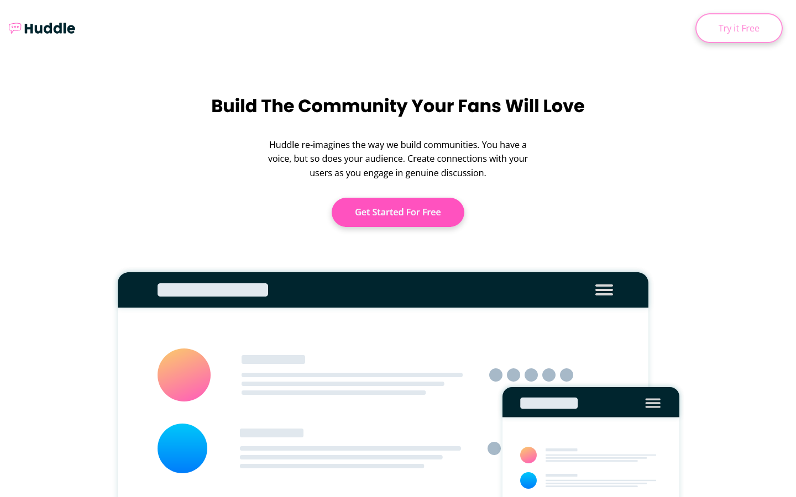
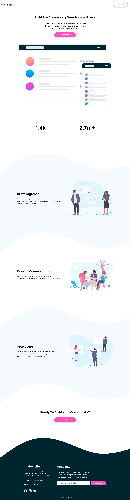

# Frontend Mentor - QR code component solution

This is a solution to the [QR code component challenge on Frontend Mentor](https://www.frontendmentor.io/challenges/huddle-landing-page-with-curved-sections-5ca5ecd01e82137ec91a50f2). Frontend Mentor challenges help you improve your coding skills by building realistic projects. 

## Table of contents

- [Overview](#overview)
  - [The Challenge](#the-challenge)
  - [Screenshot](#screenshot)
  - [Links](#links)
- [My process](#my-process)
  - [Built with](#built-with)
  - [What I learned](#what-i-learned)
  - [Continued development](#continued-development)
  - [Useful resources](#useful-resources)
- [Author](#author)
- [Acknowledgments](#acknowledgments)

## Overview

### The Challenge

Your users should be able to:

- View the optimal layout for the site depending on their device's screen size
- See hover states for all interactive elements on the page

### Screenshot




<!--  -->

### Links

- [Solution](https://www.frontendmentor.io/solutions/qr-code-component-using-html-and-css-rkkG2nDVc)
- [Live Site](https://frontend-mentor-challeneges.netlify.app/huddle-landing-page/)

## My process

### Built with

- Semantic HTML5 markup
- CSS custom properties
- Flexbox

### What I learned

I learned to use minimum breakpoints to simplify the layouts while adding responsiveness with mobile and desktop with media queries.

Improving readbility of the website with just two lines of CSS.

Adding SVG curves to differentiate sections and add some color and shape to the design.


```css
@media screen and (max-width: 70em) {
    .features__content h2,
    .intro h2 {
        font-size: 1.75rem;
    }

    .features section .centerish {
        margin: auto;
        text-align: center;
    }
}
```
```css
.centerish {
    max-inline-size: max-content;
    margin-inline: auto;
}
```

```html

<svg xmlns="http://www.w3.org/2000/svg" viewBox="0 0 1440 320"><path
                        fill="#00252e"
                        fill-opacity="1"
                        d="M0,320L60,277.3C120,235,240,149,360,117.3C480"
                    ></path></svg>
```

### Continued development

I would like add more structure in html and use a css methodology like BEM, CUBE CSS to add more readbility and simplification to the code.

Learning to add css animations to elements of the website.

### Useful resources

- [SVG](https://developer.mozilla.org/en-US/docs/Web/SVG) | [SVG Waves Generator](https://getwaves.io/) - These helped me for to understand SVG elements. How to add them to html, style them with css and using a generator to creator custom wavy svg image for sections and footer.

- [CSS Image Overlay - W3schools](https://www.w3schools.com/howto/howto_css_image_overlay_title.asp) - This helped me to understand how to add overlay to an image.

## Author

- Website - [Piyath Perera](https://piyathperera.netlify.app)
- Frontend Mentor - [@piyathperera](https://www.frontendmentor.io/profile/piyathperera)
- Twitter - [@PiyathPerera](https://www.twitter.com/PiyathPerera)

## Acknowledgments

I would like to acknowledge the internet and everyone contributing in it by creating videos, tutorials, articles and answering questions.Those resources are helping me to be a better developer today.
