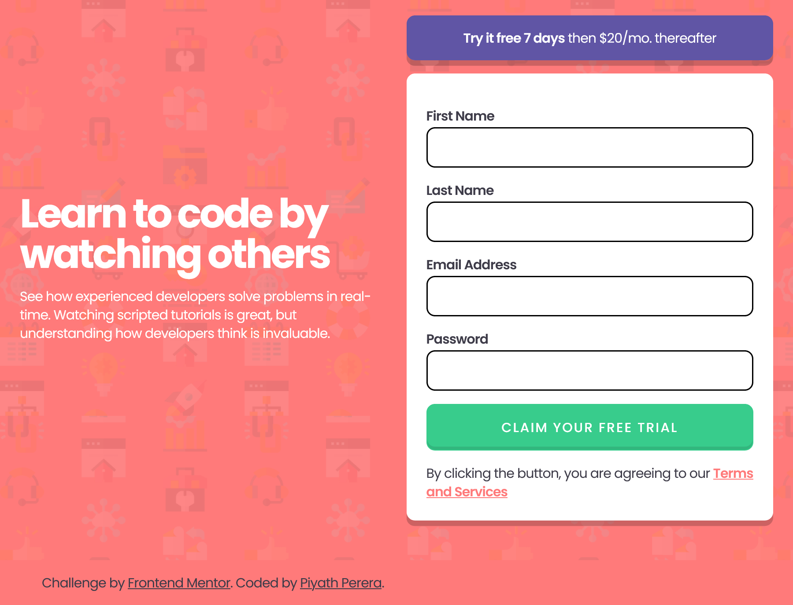

# Frontend Mentor - Easybank Landing Page solution

This is a solution to the [Intro component with sign-up form](https://www.frontendmentor.io/challenges/intro-component-with-signup-form-5cf91bd49edda32581d28fd1). Frontend Mentor challenges help you improve your coding skills by building realistic projects.

## Table of contents

-   [Overview](#overview)
    -   [The Challenge](#the-challenge)
    -   [Screenshot](#screenshot)
    -   [Links](#links)
-   [My process](#my-process)
    -   [Built with](#built-with)
    -   [What I learned](#what-i-learned)
    -   [Continued development](#continued-development)
    -   [Useful resources](#useful-resources)
-   [Author](#author)
-   [Acknowledgments](#acknowledgments)

## Overview

### The Challenge
Practice building out a sign-up form complete with client-side validation using JavaScript.

Your users should be able to:

- View the optimal layout for the site depending on their device's screen size
- See hover states for all interactive elements on the page
- Receive an error message when the form is submitted if:
  - Any input field is empty
  - The email address is not formatted correctly

### Screenshot
TODO: Needs Update

Dekstop

<!--  
Mobile -->

### Links

-   [Solution](https://www.frontendmentor.io/solutions/easybank-landing-page-with-vite-cube-css-and-fluid-types-9fX7x5vExJ)
-   [Live Site](https://piyath-easybank-landing-page.netlify.app/)

## My process

### Built with

-   Semantic HTML5 markup
-   [CUBE CSS](https://cube.fyi/) - CSS Methodology
-   [Utopia](https://utopia.fyi/) - Fluid Types and Spacing
-   Responsive Design
-   [Vite](https://vitejs.dev/) - Frontend Tooling
-   Javascript - Accessible form validation

### What I learned

I learned to Be the browser’s mentor, not its micromanager with help of [Andy Bell's Talk](https://www.youtube.com/watch?v=5uhIiI9Ld5M) and his [CUBE CSS](https://cube.fyi/) methodology helped to maintain CSS more readable, maintainable and create a good enough foundation for the content in any form of design with progressive enhancement in mind.

Design is more responsive with the help of [Utopia](https://utopia.fyi/) for its maths and magic to produce Fluid types for Font-sizes and Fluid spaces for padding, margins. Need to learn more about Design tokens in making them as well as using them in projects.

Accessibility is still a learning curve, gained a lot of insight into what needs to be considered for different browser and screen readers and steps to mitigate to represent the correct behavior of the content I produce. Icons Buttons, Buttons interactions and Navigations are on Top pirority. Also learn to navigation completed design with windows narrator: which helped in making well informed decisions on svg+link interactions.

Learned to add changes and decided not to make Pixel perfect designs as [Josh w Comeau's article](https://www.joshwcomeau.com/css/pixel-perfection/) perfectly laid out. Usability is one of main interesting areas that more website designs could improve upon. I changed Mobile Menu interation and Links appearing as underlined text. In Future, I wil make changes to make the design more accessible and usable for everyone. 

### Continued development

- Refactor and write more clean code.
- Change the Design more to adhere to well knowed Usability Principles.
- Accessibility and Test if everything works.
- Learning css animations to elements of the website.

### Useful resources

-   [Usable and Accessible form validation](https://webaim.org/techniques/formvalidation/) - Helped to make the form validation better and accessible.

-   [Create accessible forms](https://www.a11yproject.com/posts/how-to-write-accessible-forms/#always-label-your-form-inputs) - Helped to maintain and build an accessible form with a checklist for future reference.

-   [Better native form validation](https://oliverjam.es/blog/better-native-form-validation/) - This helped me to learn and build native form validation with custom error message with [Constraint validatio API](https://developer.mozilla.org/en-US/docs/Web/Guide/HTML/Constraint_validation).

## Author

-   Website - [Piyath Perera](https://piyathperera.com.au)
-   Frontend Mentor - [@piyathperera](https://www.frontendmentor.io/profile/piyathperera)
-   Twitter - [@PiyathPerera](https://www.twitter.com/PiyathPerera)

## Acknowledgments

I would like to acknowledge the internet and everyone contributing in it by creating videos, tutorials, articles and answering questions. Those resources are helping me to be a better developer today.
