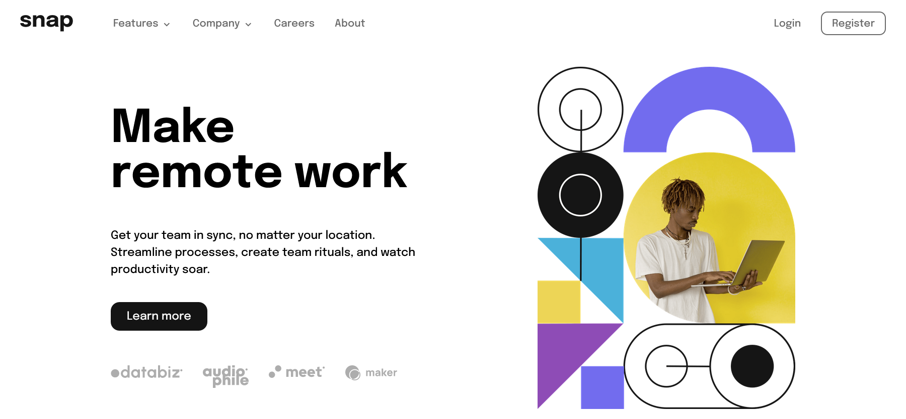

# Frontend Mentor - QR code component solution

This is a solution to the [Intro section with dropdown navigation](https://www.frontendmentor.io/challenges/intro-section-with-dropdown-navigation-ryaPetHE5). Frontend Mentor challenges help you improve your coding skills by building realistic projects.

## Table of contents

-   [Overview](#overview)
    -   [The Challenge](#the-challenge)
    -   [Screenshot](#screenshot)
    -   [Links](#links)
-   [My process](#my-process)
    -   [Built with](#built-with)
    -   [What I learned](#what-i-learned)
    -   [Continued development](#continued-development)
    -   [Useful resources](#useful-resources)
-   [Author](#author)
-   [Acknowledgments](#acknowledgments)

## Overview

### The Challenge

Your users should be able to:

-   View the relevant dropdown menus on desktop and mobile when interacting with the navigation links
-   View the optimal layout for the content depending on their device's screen size
-   See hover states for all interactive elements on the page

### Screenshot


Dekstop

 
Mobile

### Links

-   [Solution](https://www.frontendmentor.io/solutions/sunnyside-agency-landing-page-with-css-grid-and-flexbox-HyMoJC9Hc)
-   [Live Site](https://frontend-mentor-challeneges.netlify.app/intro-section-with-dropdown-navigation/)

## My process

### Built with

-   Semantic HTML5 markup
-   SASS pre-processor with build setup
-   Flexbox
-   CSS Grid
-   Javascript

### What I learned

I learned about responsive images with help of [MDN article](https://developer.mozilla.org/en-US/docs/Learn/HTML/Multimedia_and_embedding/Responsive_images) which uses <source> elements wrapped with <picture> element to have seperate images for different screen sizes and serving up two images when the screen size is changed.

```html
<picture>
    <source media="(max-width: 799px)" srcset="elva-480w-close-portrait.jpg" />
    <source media="(min-width: 800px)" srcset="elva-800w.jpg" />
    
</picture>
```

I learned about creating dropdown menu, it's easy right? just list of links showing vertically when you hover/click on down arrow icon. But read a great [article](https://adrianroselli.com/2019/06/link-disclosure-widget-navigation.html) on why its not that easy. In terms of a11y, need to consider visually events upon clicking as well as any user using a keyboard to get ability to close, open and navigate the menu.

```html
<ul id="menu" data-visible="false">
    <li>
        <a href="">Features</a>
        <button
            id="btnFeature"
            class="expanded-button"
            aria-controls="id_features_menu"
            aria-expanded="false"
            aria-label="More Features pages"
            onclick="toggleSubNav(this.id)"
        >
            <svg width="10" height="6" xmlns="http://www.w3.org/2000/svg">
                <path
                    stroke="#686868"
                    stroke-width="1.5"
                    fill="none"
                    d="m1 1 4 4 4-4"
                />
            </svg>
        </button>
        <ul id="id_features_menu" data-visible="false">
            <li>
                <a href="#"
                    >Todo List</a
                >
            </li>
            <li>
                <a
                    href="#"
                    >Calendar</a
                >
            </li>
        </ul>
    </li>
</ul>
```

```js
document.onkeydown = function (evt) {
    evt = evt || window.event;
    var isEscape = false;
    if ("key" in evt) {
        isEscape = evt.key == "Escape" || evt.key == "Esc";
    } else {
        isEscape = evt.keyCode == 27;
    }
    if (isEscape) {
        //alert("Escape");
        toggleSubNav("");
    }
};
```

I learned sass, a pre processor helps css to become more powerful and have more features like nesting, custom properties and conditional statements. These superp powers helps me in this project to reduce the number of css classes i had to write and encapsulate styles in their own components, also made them easier to find when making changes.


```css
        #menu[data-visible="true"] {
            transform: translateX(0%);

            li {
                position: relative;
                ul {
                    &[data-visible="true"] {
                        display: flex;
                        position: static;
                        box-shadow: none;
                        margin: 0;
                    }
                }
            }

            & li.btn__link {
                display: block;
                width: 100%;
                text-align: center;
                // background-color: lightcoral;

                &--primary {
                    display: block;
                    width: 100%;
                    text-align: center;
                }
            }
        }
```

### Continued development

I would like add more structure in html and use a css methodology like BEM, CUBE CSS to add more readbility and simplification to the code.

Learning to add css animations to elements of the website.

### Useful resources

-   [Responsive images - MDN](https://developer.mozilla.org/en-US/docs/Learn/HTML/Multimedia_and_embedding/Responsive_images/) - These helped me for to understand responsive design for images. It clearly outlined step by step approach to make images responsive.

-   [SASS setup - Stephanie Eckles](https://thinkdobecreate.com/articles/minimum-static-site-sass-setup/) - This helped me to setup sass preprocessor with all packages and build setups needed.

-   [Link + Disclourse Widget Navigation - AdriaN Roselli](https://adrianroselli.com/2019/06/link-disclosure-widget-navigation.html) - This helps to create a dropdown menu the right way and helps to use with a11y.

## Author

-   Website - [Piyath Perera](https://piyathperera.netlify.app)
-   Frontend Mentor - [@piyathperera](https://www.frontendmentor.io/profile/piyathperera)
-   Twitter - [@PiyathPerera](https://www.twitter.com/PiyathPerera)

## Acknowledgments

I would like to acknowledge the internet and everyone contributing in it by creating videos, tutorials, articles and answering questions.Those resources are helping me to be a better developer today.
