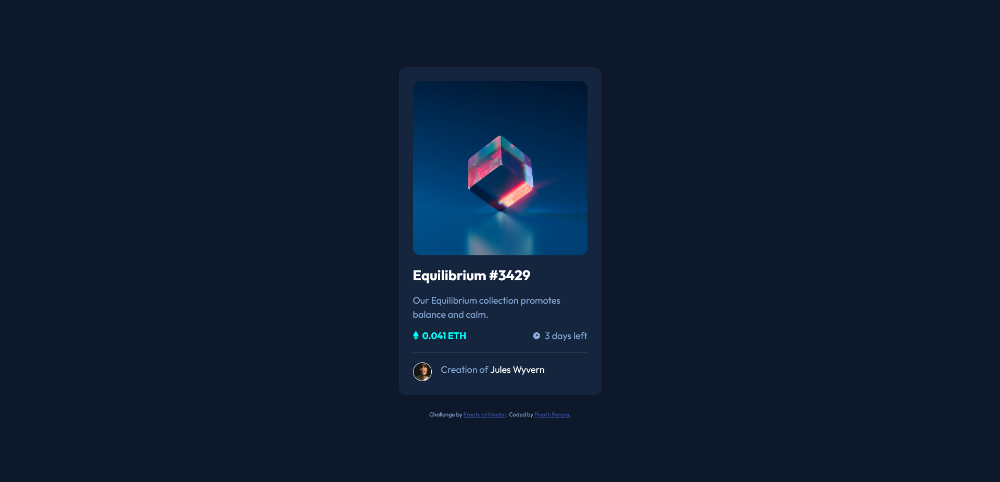

# Frontend Mentor - QR code component solution

This is a solution to the [QR code component challenge on Frontend Mentor](https://www.frontendmentor.io/challenges/qr-code-component-iux_sIO_H). Frontend Mentor challenges help you improve your coding skills by building realistic projects. 

## Table of contents

- [Overview](#overview)
  - [The Challenge](#the-challenge)
  - [Screenshot](#screenshot)
  - [Links](#links)
- [My process](#my-process)
  - [Built with](#built-with)
  - [What I learned](#what-i-learned)
  - [Continued development](#continued-development)
  - [Useful resources](#useful-resources)
- [Author](#author)
- [Acknowledgments](#acknowledgments)

## Overview

### The Challenge

Your users should be able to:

- View the optimal layout depending on their device's screen size
- See hover states for interactive elements

### Screenshot



### Links

- [Solution](https://www.frontendmentor.io/solutions/qr-code-component-using-html-and-css-rkkG2nDVc)
- [Live Site](https://frontend-mentor-challeneges.netlify.app/qr-code-component-main/)

## My process

### Built with

- Semantic HTML5 markup
- CSS custom properties
- Flexbox

### What I learned

I learned about CSS custom properties and how to use them in writing better more organized css. 
I also familar with css pseudo classes for managing different states with hover and manage overlays with controlling opacity in css class and html imgae element


```css
img-container:hover .img-icon {
    opacity: 1;
}
```
```css
.img-container .img-overlay {
    position: absolute;
    background: var(--cyan-a5);
    left: 0;
    top: 0;
    bottom: 0;
    right: 0;
    opacity: 0;
}
```

### Continued development

I would like add more structure in html and use a css methodology like BEM, CUBE CSS to add more readbility and simplification to the code.

### Useful resources

- [Custom properties - CSS Tricks](https://css-tricks.com/a-complete-guide-to-custom-properties/) | [Color & Custom Properties](https://www.youtube.com/watch?v=HxJnvCOC2vQ) - These helped me for to understand custom css variables. I used this for defining base collors and fonts for this project. I really liked this pattern and will use it going forward.
- [CSS Image Overlay - W3schools](https://www.w3schools.com/howto/howto_css_image_overlay_title.asp) - This helped me to understand how to add overlay to an image.

## Author

- Website - [Piyath Perera](https://piyathperera.netlify.app)
- Frontend Mentor - [@piyathperera](https://www.frontendmentor.io/profile/piyathperera)
- Twitter - [@PiyathPerera](https://www.twitter.com/PiyathPerera)

## Acknowledgments

I would like to acknowledge the internet and everyone contributing in it by creating videos, tutorials, articles and answering questions.Those resources are helping me to be a better developer today.
